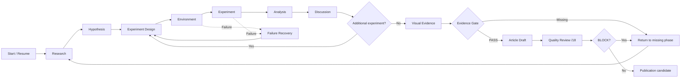

# Technical Blog Work Agent

ChatGPT Workで、技術テーマの調査から仮説、検証、分析、考察、追加検証、記事化、品質レビューまでを再利用可能なAgent / Skills / Memory / Resourcesとして運用し、GitHub + MLflowでAgent自体を継続評価・改善するContent MLOps構成一式。

## Design boundaries

- `agent/`: 全体オーケストレーション、Phase遷移、Evidence Gate、再開判断
- `skills/`: 工程別の再利用可能ワークフロー
- `memory/`: 長期間変わらない作業嗜好のみ
- `resources/`: 固定ポリシー、Google品質基準、Evidence Gate、テンプレート、Rubric
- `Project Files`: Research Question、実験証拠、分析、Phase状態のSource of Truth
- `tools/`: 構造と必須ポリシー参照を機械検査


## Supported technical content

主な対象は技術系ブログ。例: Linux、HPC、Slurm、BeeGFS、Lustre、Docker、Apptainer、Kubernetes、AWS、GCP、Azure、MLflow、Machine Learning、LLM、Python、Web、WordPress、nginx、MLOps、DevOps、インフラ構築、性能検証、障害解析、トラブルシューティング、製品比較、ベンチマーク。

## Workflow



## Resources

```text
resources/
├── environment-policy.md
├── source-policy.md
├── google-search-quality-policy.md
├── eeat-quality-policy.md
├── evidence-gate.md
├── project-layout.md
├── project-state-template.md
├── qiita-style-guide.md
├── article-template.md
├── experiment-plan-template.md
├── evidence-record-template.md
├── article-quality-contract.md
├── review-rubric.md
├── content-mlops-concept.md
├── versioning-policy.md
├── evaluation-policy.md
├── human-review-policy.md
└── production-metrics-policy.md
```

## Fixed environment

- Apple M5 Max / 128GB
- Apple Silicon / arm64
- macOS（実バージョンは検証時に取得）
- Python 3.14.6
- uv
- 常駐サービスはDocker Compose
- arm64 / multi-arch image優先
- ML/GPUはMPS / Metal / MLX等のApple Silicon nativeを優先

## Project state

記事ProjectはAgent Repositoryの外側へ置く。標準は次の構成。

```text
~/dev/
├── technical-blog-work-agent/
└── technical-blog-projects/
```

新規Projectは `tools/init_article_project.py` で初期化する。initializerは `PROJECT_STATE.md`、Version Snapshot、実値入り `AGENT_TASK.md` を自動生成し、人間によるVersion情報の転記を不要にする。
再開時はこのファイルと実成果物を確認し、完了済みPhaseを不要に繰り返さない。

STEP 1.5は、生成された `AGENT_TASK.md` をAgentへ1回渡し、Evidence Gate PASS後に `article-drafting` を実行して実 `article.md` を保存する工程である。完了は `tools/verify_article_project.py` で検証する。

## Initial Python bootstrap

最初にuvでPython 3.14.6そのものを導入し、project environmentを作る。

```bash
cd technical-blog-work-agent
uv python install 3.14.6
uv python pin 3.14.6
uv sync
source .venv/bin/activate
python --version
```

期待値:

```text
Python 3.14.6
```

詳細は `docs/implementation/00-environment-bootstrap.md` を参照する。

## Local validation

activate済み環境で:

```bash
python tools/validate_skills.py
```

期待結果:

```text
OK: 11 skills, package policies, and Content MLOps files validated
```


## Content MLOps extension (v0.5.1)

```text
GitHub = what changed
MLflow = did quality change
Qiita / GA4 = future production performance
```

Offline QualityとProduction Performanceは分離する。

v0.5.1ではProject Evidence Gateに加えてReader-visible Evidence Gateを導入し、Publishableと`QUALITY_READY`を分離する。技術選定理由は今回の採用構成、採用理由、適用条件・制約へ対応させ、不採用案を必須にしない。実障害ではエラーメッセージを最重要Evidenceとして、失敗操作、原因、切り分け、効果がなかった方法、修正、再実行結果まで追跡する。エラーEvidence欠落はGateをFAILにするが、品質点の上限へ機械変換しない。Machine Scorerは構造契約を検査し、人間または独立Reviewerの18点品質評価を代替しない。

Implementation order:

0. `docs/implementation/00-environment-bootstrap.md`
1. `docs/implementation/01-github-versioning.md`
1.5. `docs/implementation/01.5-baseline-article-generation.md`
2. `docs/implementation/02-mlflow-offline-evaluation.md`
3. `docs/implementation/03-fixed-evaluation-dataset.md`
4. `docs/implementation/04-human-review.md`

MVPではChatGPT Workで生成した成果物をMLflowへ渡す半自動評価から開始する。
