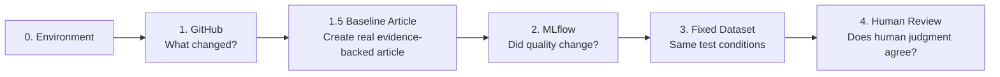

# Content MLOps Implementation Roadmap

## Scope

共通Environment Bootstrapの後、以下の順で実装する。

0. uv / Python 3.14.6 Environment Bootstrap
1. GitHubバージョニング
1.5. **Baseline Article Generation** — 実際の `article.md` をChatGPT Work Agentで生成
2. MLflow Offline Evaluation
3. 固定Evaluation Dataset
4. Human Review

Qiita / GA4のProduction Evaluationはこの段階が安定した後に実装する。

## Why this order



GitHubなしでは評価結果の原因となった変更を追えない。
実記事なしではMLflow Offline Evaluationの入力が存在しない。
MLflowなしではversion間の品質比較が散在する。
固定Datasetなしでは比較条件が揃わない。
Human ReviewなしではLLM / machine評価の妥当性を確認できない。

## Repository boundary

```text
~/dev/
├── technical-blog-work-agent/      # AgentのGitHub Source of Truth
└── technical-blog-projects/        # 実記事・実験Evidence
```

記事ProjectをAgent Repository内へ作らない。

## MVP boundary

ChatGPT Work AgentをローカルPythonから自動呼び出すことはMVP要件にしない。

STEP 1.5でArticle Projectを1コマンドで初期化し、Version identityと実値入り `AGENT_TASK.md` を自動生成する。
利用者はそのタスクをChatGPT Workへ1回渡し、AgentがEvidence Gate PASS後に `article-drafting` を実行して `article.md` を保存する。
STEP 2以降では、その成果物をローカルMLflow evaluatorへ渡す。

## Mandatory bootstrap

STEP 1〜4でPythonを使用する前に、以下が成立していること。

```text
uv python install 3.14.6 済み
uv python pin 3.14.6 済み
uv sync 済み
source .venv/bin/activate 済み
python --version == Python 3.14.6
```

詳細: `00-environment-bootstrap.md`
