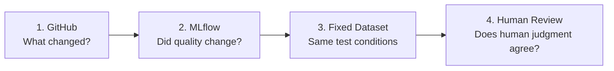

# Content MLOps Implementation Roadmap

## Scope

まず以下の4段階を実装する。

1. GitHubバージョニング
2. MLflow Offline Evaluation
3. 固定Evaluation Dataset
4. Human Review

Qiita / GA4のProduction Evaluationはこの4段階が安定した後に実装する。

## Why this order

GitHubなしでは評価結果の原因となった変更を追えない。
MLflowなしではversion間の品質比較が散在する。
固定Datasetなしでは比較条件が揃わない。
Human ReviewなしではLLM / machine評価の妥当性を確認できない。

## MVP boundary

ChatGPT Work AgentをローカルPythonから自動呼び出すことはMVP要件にしない。

固定Datasetの各test caseをChatGPT Workへ入力し、生成されたProject / articleをローカルMLflow evaluatorへ渡す半自動方式から始める。
