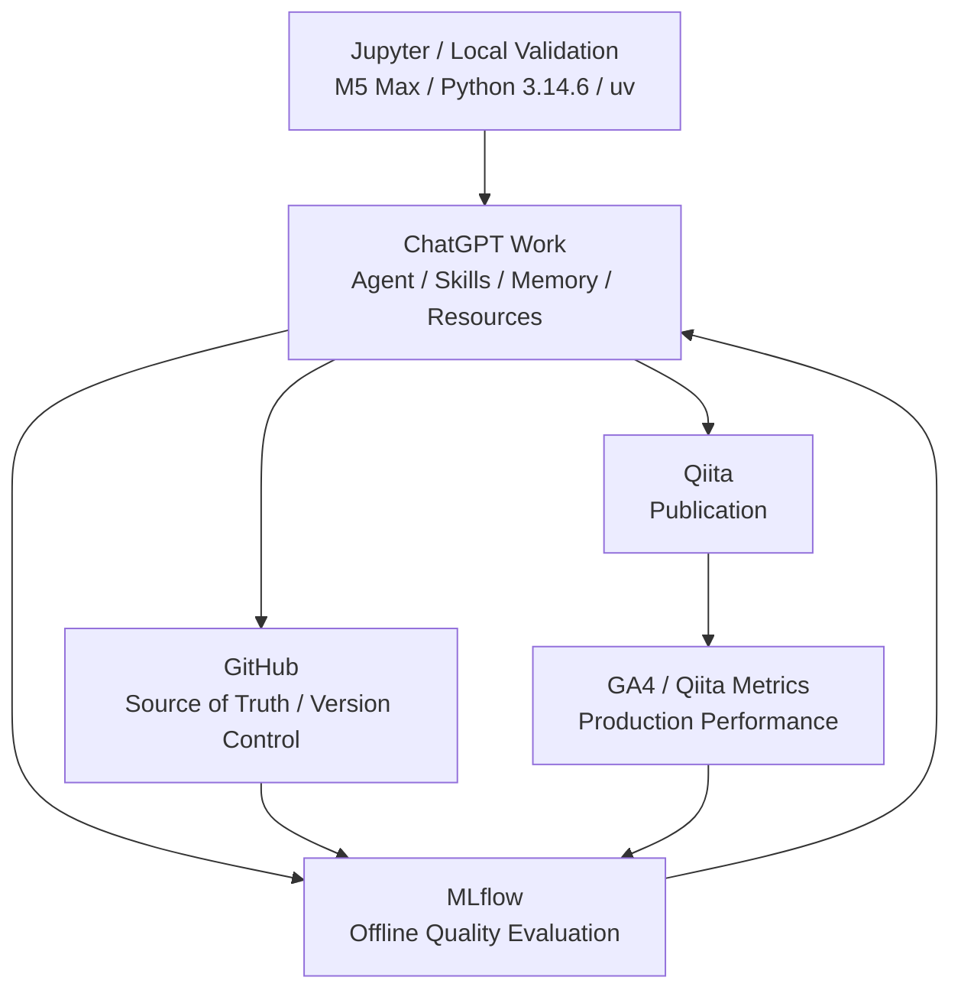

# Content MLOps Concept

## Purpose

このAgentを「AIで記事を書く仕組み」ではなく、**技術コンテンツの品質を継続的に計測し、改善するContent MLOps基盤**として運用する。

## Core loop

## Responsibility split

### GitHub

GitHubは「**何を変更したか**」のSource of Truthとする。

管理対象:

- Agent instructions
- Skills
- Resources
- Templates
- Scorers
- Evaluation Datasetの原本
- Python code
- CHANGELOG
- Git tags / releases

### MLflow

MLflowは「**変更した結果、品質がどう変わったか**」を管理する。

管理対象:

- Agent version / Git commitとの対応
- Offline evaluation
- Traces
- Code-based scorers
- LLM Judge（利用時）
- Human Review
- Evaluation Datasetの実行用コピー
- 将来のProduction Metrics

GitHubの代わりにAgent / Skillのファイル本体をMLflowだけで管理しない。

### ChatGPT Work

ChatGPT Workは技術調査、仮説、実験、分析、考察、記事化を実行する。

当面はChatGPT Workを外部APIから完全自動実行できることを前提にしない。
固定Evaluation Datasetに対する生成は人間が開始し、生成物をMLflowへ渡す**半自動評価**をMVPとする。

### Qiita / GA4

公開後データはProduction Performanceとして扱う。

**PVやOrganic Sessionsを記事品質そのものとみなしてはならない。**
テーマ需要、公開時期、タグ、SNS流入などの交絡要因があるため、Offline QualityとProduction Performanceを分離して保存し、後から関係を分析する。

## Two evaluation layers

### Offline Quality

記事公開前に評価する。

- Experience
- Expertise
- Authoritativeness
- Trustworthiness
- Originality
- Reproducibility
- Usefulness
- Evidence
- Clarity
- machine checks
- human review

### Production Performance

公開後に評価する。

将来対象:

- GA4 Organic Sessions
- Engagement
- Users
- Qiita Views
- Likes
- Stocks
- Comments

取得タイミングの標準候補:

- Day 7
- Day 30
- Day 90

## Improvement rule

Production PerformanceまたはOffline Qualityが悪化しても、Agent / Skillを自動で書き換えない。

1. 問題を観測する
2. 原因仮説を作る
3. 改善案を作る
4. Git branchで変更する
5. 固定Evaluation Datasetで再評価する
6. 改善を確認してからmerge/tagする

これによりAgent改善自体を仮説検証型にする。
