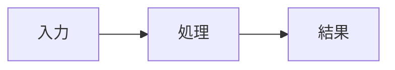

# Qiita Style Guide

## 基本

- H1は記事タイトルに1つだけ使う。
- H2で大きな工程を分割する。
- コマンドは言語識別子付きコードブロックを使う。
- 初学者が迷う箇所は補足を置く。
- 「なぜこのコマンドを実行するか」を先に説明する。
- 長いログは必要箇所に絞る。

## Note

必要に応じてQiitaの補足表現を使う。

```markdown
:::note info
ここは補足情報です。
:::
```

注意事項:

```markdown
:::note warn
この操作は既存データへ影響する可能性があります。
:::
```

## Mermaid

処理の関係を図示した方が理解しやすい場合はMermaidを使う。



## 画像プレースホルダー

画像をまだ取得していない場合は本文へ架空の画像を埋め込まない。

```markdown
<!-- SCREENSHOT:
画面: MLflow Run details
目的: metricsが記録されたことを示す
注目箇所: accuracy / loss
-->
```

## HTML

原則Markdownを使う。QiitaでMarkdownだけでは表現しづらく、Qiita側で許可されるHTMLが必要な場合のみ補助的に使用する。可搬性を損なう装飾HTMLを多用しない。

## Screenshot / graph links

取得したEvidence画像は `images/` で管理し、Qiitaへアップロード後は実URLへ置換する。

```markdown

```

記事草稿段階でURLが未確定の場合は、架空URLを作らず次のプレースホルダーを使う。

```markdown
<!-- IMAGE_LINK: images/mlflow-run-metrics.png / Qiita upload後にURLへ置換 -->
```

